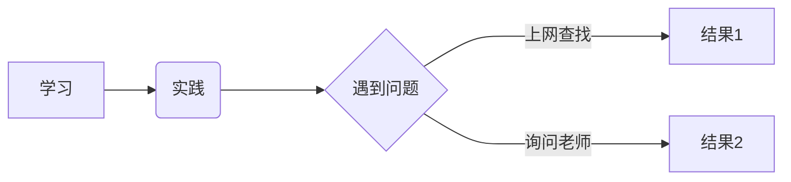
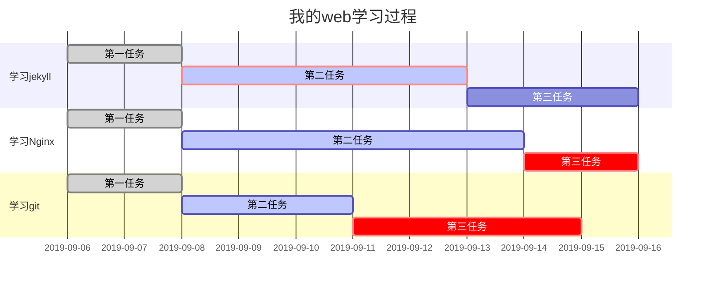

我的MARKDOWN练习

# Markdown学习

## 一.MARKDOWN标题

## 书写方式(2种)

#### 1.文本换行 加=

>>一级标题
===========================

>>>二级标题
-----------------------------

#### 2.____# 后空格+文本
>># 一级标题
>>>## 二级标题
>>>>### 三级标题
>>>>>#### 四级标题
>>>>>>##### 五级标题

----------------------------

## 二.MARKDOWN字体

1. *斜体*
2. **粗体**
3. ***粗斜体***
4. 粗斜体： ___粗斜体___
5. 删除文本 ：~~删除文本~~

---

## 三.MARKDOWN列表

#### 有序列表:1. 空格+文本
>1. 
>2. 

#### 无序列表:(1)用+ 空格 (2)* 空格 
>+ 
>* 

#### **这是有序列表和无序列表的混用**
>无序列表作为有序列表的子列表的时候，需要再子列表的字段前面加一个Tab键
1. 考研
    - 英语
    - 数学
    + 政治
    * 专业课
2. 工作
    - 代码
    + 面试
    * ....

-------------------------------------

## 四.MARKDOWN链接
#### [链接名称](链接地址) *参考式实现* 我经常去的几个网站

>[菜鸟教程](https://www.runoob.com)

>[CSDN](https://www.csdn.net)

>[Github](https://github.com)

-----------------------------------

## 五.MARKDOWN高级技巧

